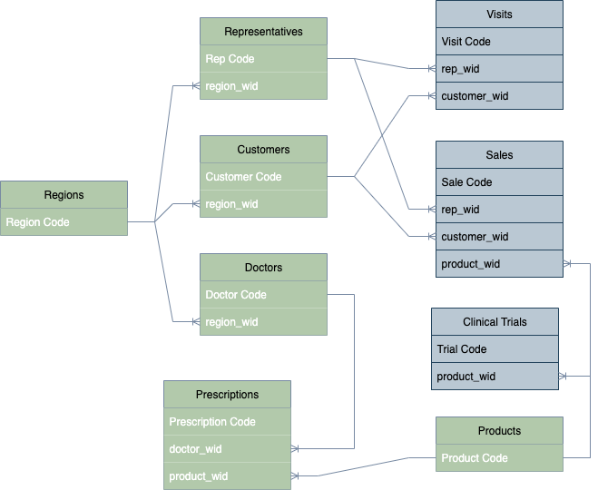

# 🛠️ CSV to Analytics: A Layered Data Engineering Pipeline in Python

## 📌 Project Overview

This repository presents the result of a data engineering and modeling process 
based on raw CSV files. The data flows through a layered architecture inspired 
by the **medallion model** used in modern data lakehouses.

The final outcome includes structured and cleaned datasets—ideal for business 
reporting and analytics—organized in **Bronze**, **Silver**, **Gold**, 
and **Platinum** layers. Each layer represents a higher level of data 
quality, integration, and modeling.

This work is part of the **Data Engineering** branch of the data ecosystem, 
with some overlap in **Data Modeling** to support advanced analytical use cases.

---

## 📁 Data Layer Structure

```bash
project-root/
│
├── data/
│   ├── raw/              # Raw CSV files (input)
│   ├── bronze/           # Cleaned and standardized data
│   ├── silver/           # Enriched data with type casting, filtering, and basic joins
│   └── gold/             # Modeled tables ready for analysis and reporting
│
├── scripts/
│   ├── bronze_to_silver  # Reading raw files and identify incorrect values
│   ├── silver_to_gold    # Modeling the tables and renaming fields
│   └── gold_to_platinum  # Specific joins and modeling logic
│
├── reports/              # Output reports or sample queries
├── logging/              # Logs created with each execution to audit the process
├── README.md             # Project documentation
└── requirements.txt      # Python dependencies
```
---

### Bronze Layer – Raw Ingestion Layer

This layer contains the ingested raw data, extracted directly from CSV files.

- Possible duplicates, invalid values, or nulls may exist  
- No type casting or formatting corrections  
- No filtering or transformation  

**Goal:** Preserve fidelity to the source, enabling full traceability, 
reproducibility, and auditing.

---

### Silver Layer – Cleaned & Validated Layer

This layer introduces semantic cleaning and validation to improve data 
quality for downstream processing:

- Removal of duplicate records  
- Data type corrections (e.g., dates, numbers, booleans)  
- Handling or flagging of null and invalid values  
- Initial filtering (e.g., dropping corrupted rows)  

**Goal:** Identify and correct data quality issues to ensure consistent and 
reliable inputs for analysis and modeling.

---

### Gold Layer – Modeled & Joined Layer

At this stage, the cleaned data is modeled into analytical structures:

- Fact and dimension tables are built  
- Key relationships established through joins (e.g., sales → reps, products, customers)  
- Business logic applied (e.g., durations, outcome classifications, aggregations)  

**Goal:** Structure the data using meaningful names and surrogate keys, 
ensuring full relational integrity across entities.

---

### Platinum Layer – Curated Business Layer

The platinum layer consists of highly curated, lightweight tables 
tailored for direct analytical consumption:

- Denormalized when necessary for performance and usability  
- Optimized for use in reporting tools and dashboards  
- Focused on KPIs and advanced analytics  
- Final tables may include business-friendly renaming and selective column presentation  
- Contains final business entities (e.g., `sales_summary`, 
`prescription_behavior`, `clinical_success_rates`)  

**Goal:** Deliver clear, efficient, and business-oriented tables optimized 
for reporting and advanced analytical use cases.


---

## 🧰 Technologies Used

This project is developed entirely in **Python**, following best practices in data processing and pipeline design. Key tools and libraries include:

- **Pandas** – For data ingestion, transformation, cleaning, joins, and filtering operations  
- **os / pathlib** – To manage dynamic file paths across the project  
- **datetime** – Used for timestamping and custom logging functionality  
- **tabulate** – For clean and readable table outputs in the console  
- **seaborn** – For data visualization and exploratory analysis  

### 🧱 Data Modeling & Architecture

- Applied **dimensional modeling techniques** including:
  - Surrogate keys (e.g. `row_wid`)
  - Consistent naming conventions across tables
  - Structured join logic between fact and dimension tables  

- Implemented a **layered architecture** for data processing:
  - **Bronze** → Raw ingestion  
  - **Silver** → Cleaned and structured  
  - **Gold** → Business-ready aggregates  
  - **Platinum** → Final analytics-ready dataset
 

